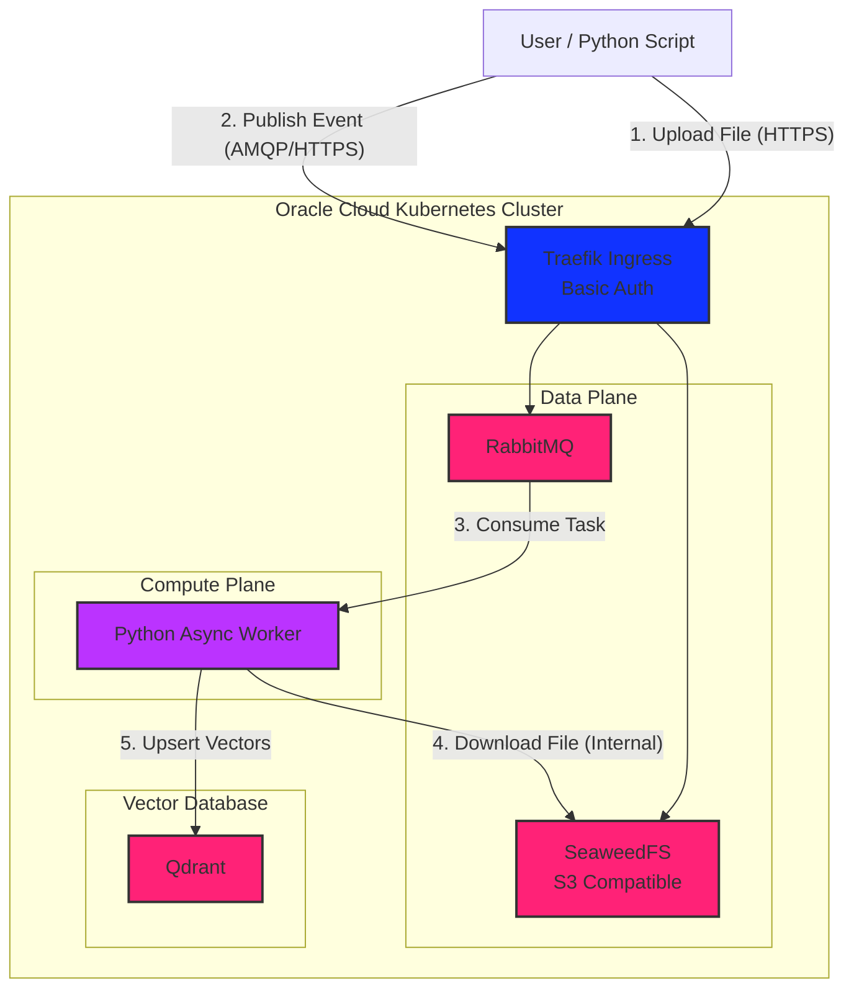

# Asynchronous RAG Ingestion Platform

An event-driven RAG pipeline designed for high-throughput document ingestion on edge infrastructure (Oracle ARM).

This project demonstrates Platform Engineering principles: asynchronous processing, idempotent data handling, and infrastructure-as-code (IaC).

| Component       | Technology        | Role                  |
|-----------------|-------------------|-----------------------|
| Language        | 	Python 3.12	     | Ingestion Logic       |
| Package Manager | 	uv	              | Dependency Management |
| Queue           | 	RabbitMQ         | 	Task Broker          |
| Storage         | 	SeaweedFS        | 	Object Storage (S3)  |
| Vector DB       | Qdrant	           | Embedding Storage     |
| Container       | 	Docker           | 	Runtime Environment  |
| Orchestrator    | 	Kubernetes (K3s) | 	Cloud Deployment     |

# Architecture

# Roadmap

- Observability with Prometheus
- Deployment automation
- Autoscaling with KEDA